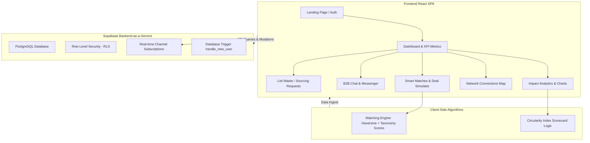

# ♻️ MOLE — Circular Economy B2B Marketplace

> **An AI-powered B2B marketplace engineered to intelligently match industrial waste streams with verified buyers, promoting a sustainable circular economy.**

[](https://molehack2hustl.netlify.app/)
[](LICENSE)
[](https://react.dev/)
[](https://www.typescriptlang.org/)
[](https://tailwindcss.com/)
[](https://supabase.com/)

---

## 📖 Table of Contents
1. [💡 The Vision & Idea](#-the-vision--idea)
2. [⚠️ The Problem Statement](#-the-problem-statement)
3. [✨ The Circular Solution](#-the-circular-solution)
4. [🤖 Smart Matching Engine Algorithm](#-smart-matching-engine-algorithm)
5. [🌟 Key Platform Features](#-key-platform-features)
6. [🏗️ System Architecture](#-system-architecture)
7. [🗄️ Supabase Database Schema](#%EF%B8%8F-supabase-database-schema)
8. [📂 Directory & Codebase Structure](#-directory--codebase-structure)
9. [🚀 Getting Started Locally](#-getting-started-locally)
10. [🌐 Deployment & Production Build](#-deployment--production-build)
11. [📄 License & Credits](#-license--credits)

---

## 💡 The Vision & Idea

**MOLE** is an enterprise-grade SaaS and B2B marketplace platform designed to drive **industrial symbiosis**. The core philosophy of MOLE is that *one factory's waste is another factory's raw material*. By creating a transparent, real-time, and friction-free exchange network, MOLE enables factories and industrial facilities to re-integrate byproducts, scraps, and excess materials back into production cycles, establishing a highly profitable and sustainable **Circular Economy**.

---

## ⚠️ The Problem Statement

In the traditional **Linear Economy** ("Take, Make, Waste"), industrial production faces critical bottlenecks:
*   **High Operational Cost:** Factories pay enormous landfill tipping and waste disposal fees to discard secondary products and byproducts.
*   **Procurement Scarcity:** Purchasing virgin raw materials is highly volatile, carbon-intensive, and expensive. Sourcing recycled materials is highly fragmented, rely on offline brokers, and suffers from a lack of quality control.
*   **Logistical Inefficiencies:** Transporting waste over long distances is cost-prohibitive and contributes heavily to scope-3 emissions. Freight costs often kill the economics of recycling.
*   **Compliance & Audit Gaps:** Companies struggle to track, compute, and report audit-ready ESG metrics (CO2 avoided, landfill diversion percentages, circularity indexes) required by regulators.

---

## ✨ The Circular Solution

MOLE bridges the gap between waste generators (Sellers) and recyclers/manufacturers (Buyers) through:
1.  **AI-Powered Material Matching:** Deterministically pairing compatible chemical and physical byproducts with exact buyer criteria.
2.  **Proximity & Logistics Sorting:** Prioritizing localized trade connections using geolocation distance sorting to minimize freight overhead.
3.  **Predictive Waste Forecasting:** Anticipating future waste outputs using scheduling and historical data to match streams before they even exit the assembly line.
4.  **Circularity & ESG Analytics:** Auto-calculating corporate circularity scores, tracking carbon emissions saved (compared to virgin material processing), and outputting audit-ready reports.
5.  **Interactive Trade Connections Map:** Visualizing localized industrial networks and tracking verified trade relationships over time.

---

## 🤖 Smart Matching Engine Algorithm

MOLE utilizes a deterministic, multi-axial compatibility scoring algorithm running client-side and database-driven procedures. This avoids expensive ML overhead while delivering high-accuracy matching.

### 1. Score Allocation (100-Point Scale)

Each potential pair is evaluated on five primary criteria:

| Parameter | Max Points | Logic & Point Distribution |
| :--- | :--- | :--- |
| **Material Taxonomy Compatibility** | **40 pts** | Exact Sub-Category Match = `40 pts` <br> Broad Category Match = `20 pts` <br> Mismatch = `0 pts` (Immediate filter out) |
| **Proximity & Distance** | **25 pts** | `< 10 km` = `25 pts` <br> `10 - 30 km` = `22 pts` <br> `30 - 50 km` = `18 pts` <br> Within 70% of Buyer's Max Range = `14 pts` <br> Within 100% of Buyer's Max Range = `8 pts` <br> Exceeds Max Range = `0 pts` |
| **Quantity Alignment** | **20 pts** | Ratio between supply & demand in `[0.9, 1.1]` = `20 pts` <br> Ratio in `[0.7, 1.5]` = `16 pts` <br> Ratio in `[0.5, 2.0]` = `12 pts` <br> Ratio `>= 0.3` = `8 pts` <br> Ratio `< 0.3` = `4 pts` (or `10 pts` if different units) |
| **Timing & Cadence** | **15 pts** | Exact frequency match (e.g. continuous/recurring) = `15 pts` <br> Seller has Continuous supply = `13 pts` <br> Seller has Recurring and Buyer wants One-time = `12 pts` <br> Cadence mismatch = `6 pts` |

### 2. Match Threshold Actions
*   **Best Match (Score >= 80%):** Triggers immediate UI highlight, push notification, and automated deal simulation.
*   **Good Match (Score 50% - 79%):** Displayed in the opportunities dashboard as potential circular pathways.
*   **Low Match (Score < 50%):** Filtered out from recommended results to keep feeds high-value.

---

## 🌟 Key Platform Features

### 💻 Premium User Interface & Dark Mode
*   Built with an **Eco-Tech** aesthetic utilizing clean minimalist surfaces, glassmorphism containers, harmonious emerald gradients, and custom animations.
*   Includes a native, fully responsive **Dark Mode / Light Mode** switch that persists in `localStorage` for visual comfort during night operations.

### 📊 Smart Dashboard & Analytics
*   **KPI Strip:** Real-time counters showing total waste listed, active opportunities, carbon reduction in metric tons (MT), and cost savings.
*   **Circularity Index Circle:** Dynamic visual representation of the company's circular score (computed based on recycled/reused ratios and platform activity) compared against industry percentiles.
*   **Interactive Charts:** Beautiful responsive Recharts area/bar charts displaying month-over-month CO2 savings and waste diversion methods (recycled vs reused vs recovered vs landfill).

### 📦 Waste Listing & Sourcing Request Management
*   **Sellers:** Easily post waste streams with attributes like condition, hazard levels, price, frequency, and handling requirements.
*   **Buyers:** Submit material sourcing requests specifying quality grade constraints and maximum transport distances.
*   **Live Marketplace:** Google-style pagination, search querying, and filters to instantly browse active items platform-wide.

### 🗺️ Network Trade History
*   Tracks completed deals and plots company connections in an interactive relationship map detailing material type, distance, volume, and carbon saved.

### 💬 B2B Live Negotiation Chat
*   Integrated B2B messaging system. Chat directly with counterparties to negotiate terms, finalize deals, and receive real-time notifications when interest is shown.

---

## 🏗️ System Architecture



---

## 🗄️ Supabase Database Schema

The backend uses a relational database schema designed for speed, security (Row-Level Security), and real-time updates:

### 1. `companies`
Stores the corporate profiles of registered users (1-to-1 relationship with `auth.users`).
```sql
CREATE TABLE public.companies (
    id           UUID PRIMARY KEY REFERENCES auth.users(id) ON DELETE CASCADE,
    company_name TEXT        NOT NULL,
    industry_type TEXT       NOT NULL DEFAULT '',
    location      TEXT       NOT NULL DEFAULT '',
    created_at    TIMESTAMPTZ NOT NULL DEFAULT now()
);
```

### 2. `waste_listings`
Materials listed by sellers as available byproducts.
*   **Fields:** `id`, `company_id` (FK), `waste_type`, `description`, `quantity`, `unit`, `frequency`, `condition`, `hazard_level`, `handling`, `listing_location`, `price_per_unit`, `created_at`.

### 3. `material_requests`
Active procurement requests posted by buyers looking to source materials.
*   **Fields:** `id`, `company_id` (FK), `material_needed`, `quantity_required`, `unit`, `frequency`, `quality_grade`, `quality_constraints`, `delivery_location`, `max_distance_km`, `price_per_unit`, `created_at`.

### 4. `opportunities`
Circular economy matches and active deal negotiations.
*   **Fields:** `id`, `company_id` (FK), `waste_listing_id` (FK), `material_request_id` (FK), `counterparty_id` (FK), `title`, `material_from`, `material_to`, `compatibility_score`, `quality_fit`, `distance_km`, `cost_savings`, `cost_savings_pct`, `co2_saved_kg`, `water_saved_l`, `energy_saved_pct`, `volume`, `frequency`, `estimated_roi`, `time_to_close`, `certifications`, `why_match`, `is_urgent`, `status` ('active', 'accepted', 'rejected', 'expired'), `created_at`, `expires_at`.

### 5. `impact_analytics`
Aggregated monthly metrics mapping out sustainability metrics.
*   **Fields:** `id`, `company_id` (FK), `period_month`, `total_savings`, `transactions_count`, `co2_avoided_kg`, `water_saved_l`, `energy_saved_kwh`, `waste_diverted_kg`, `circularity_score`, `recycled_pct`, `reused_pct`, `recovered_pct`, `landfill_pct`, `created_at`.

### 6. `circularity_scores`
Overall scores computed for companies.
*   **Fields:** `id`, `company_id` (FK, Unique), `overall_score`, `recycled_pct`, `reused_pct`, `recovered_pct`, `landfill_pct`, `sector_percentile`, `score_delta`, `last_computed_at`, `updated_at`.

### 7. `network_connections`
Active links forming the map visualization.
*   **Fields:** `id`, `from_company_id` (FK), `to_company_id` (FK), `connection_type`, `material_type`, `volume_mt`, `distance_km`, `co2_saved_kg`, `status`, `established_at`, `last_active_at`.

### 8. `messages`
Underlying chat lines.
*   **Fields:** `id`, `sender_id` (FK), `receiver_id` (FK), `opportunity_id` (FK), `content`, `is_read`, `created_at`.

---

## 📂 Directory & Codebase Structure

```
MOLE/
├── backend/                       # Database migrations and documentation
│   ├── docs/                      # Technical documentation & matching scripts
│   │   ├── matching-engine.md     # In-depth matching logic specification
│   │   └── fix_opp.js             # Utility scripts
│   └── migrations/                # SQL Schema & security triggers scripts
│       ├── supabase-schema.sql    # Base database tables and trigger setup
│       ├── supabase-extended-schema.sql # Notifications, opportunities, analytics
│       ├── supabase-waste-schedule-schema.sql # Waste schedules and recurring events
│       └── supabase-forecast-schema.sql # Waste forecasting database definitions
│
└── frontend/                      # React frontend Single Page Application
    ├── public/                    # Static assets (images, videos, metadata)
    ├── src/                       # Source code
    │   ├── components/            # Reusable UI components
    │   │   ├── Layout.tsx         # Main frame layout, sidebar, notifications, header
    │   │   ├── ChatModal.tsx      # Inline negotiation chat window
    │   │   └── DockChat.tsx       # Bottom-right quick B2B messenger client
    │   │
    │   ├── context/               # Global states
    │   │   └── AuthContext.tsx    # Supabase authentication provider & session tracking
    │   │
    │   ├── lib/                   # Libraries, helpers, and calculation cores
    │   │   ├── db.ts              # Database client wrapper queries & mutations
    │   │   ├── location.ts        # Geolocation calculations (Haversine formula)
    │   │   ├── matching.ts        # Multi-axial matching calculation functions
    │   │   ├── supabase.ts        # Supabase API initialization client
    │   │   └── utils.ts           # Styling/Tailwind merge helpers
    │   │
    │   ├── pages/                 # Full screen page views
    │   │   ├── LandingPage.tsx    # Responsive marketing homepage with interactive counter
    │   │   ├── AuthPage.tsx       # Signup, signin, and password recoveries
    │   │   ├── Dashboard.tsx      # Circularity score ring, quick stats, active tables
    │   │   ├── ListWaste.tsx      # Waste listing creator, inventory logger
    │   │   ├── FindMaterials.tsx  # Marketplace browser, procurement planner
    │   │   ├── Matches.tsx        # Visual score rings, AI pathways, and detail cards
    │   │   ├── Opportunities.tsx  # Negotiation channels and counter-offers
    │   │   ├── Messages.tsx       # Dedicated conversation hub
    │   │   ├── ImpactAnalytics.tsx# Carbon trajectory, radar graphs, Recharts widgets
    │   │   ├── TradeHistory.tsx   # Transaction log & trade map
    │   │   ├── WasteForecast.tsx  # Scheduling calendar, forecast generators
    │   │   ├── Settings.tsx       # Company profile updates, logistics configs
    │   │   └── TermsPage.tsx      # Terms of services documentation
    │   │
    │   ├── App.tsx                # Client-side router path mappings & protection
    │   ├── index.css              # Styling themes, fonts, custom keyframes
    │   └── main.tsx               # Client entrypoint mounting
    │
    ├── tailwind.config.js         # Styling variables, custom colors, fonts
    ├── vite.config.ts             # Vite build pipeline definitions
    └── package.json               # Package dependencies configuration
```

---

## 🚀 Getting Started Locally

### Prerequisites
*   Node.js (version 16 or higher)
*   NPM or Yarn
*   A Supabase database instance (Free tier is sufficient)

### 1. Clone the repository
```bash
git clone https://github.com/YAD09/MOLE.git
cd MOLE
```

### 2. Set Up the Database
1.  Create a project on [Supabase Dashboard](https://supabase.com/).
2.  Go to the **SQL Editor** tab.
3.  Copy and run the contents of [supabase-schema.sql](file:///c:/Users/prabh/OneDrive/Desktop/mole-nepal/MOLE/backend/migrations/supabase-schema.sql) to set up core tables and triggers.
4.  Copy and run the contents of [supabase-extended-schema.sql](file:///c:/Users/prabh/OneDrive/Desktop/mole-nepal/MOLE/backend/migrations/supabase-extended-schema.sql) to add opportunities, impact tracking, and connections.
5.  Copy and run the contents of [supabase-waste-schedule-schema.sql](file:///c:/Users/prabh/OneDrive/Desktop/mole-nepal/MOLE/backend/migrations/supabase-waste-schedule-schema.sql) and [supabase-forecast-schema.sql](file:///c:/Users/prabh/OneDrive/Desktop/mole-nepal/MOLE/backend/migrations/supabase-forecast-schema.sql).
6.  *(Optional)* Run the SQL commands in `seed-dummy-data.sql` to populate the platform with sample listings, requests, and connections.

### 3. Configure Frontend Environment
Navigate to the `frontend/` directory, create a `.env` file:
```bash
cd frontend
cp .env.example .env  # Or create a new file named .env
```
Fill in your Supabase project API credentials:
```env
VITE_SUPABASE_URL=https://your-project-id.supabase.co
VITE_SUPABASE_ANON_KEY=your-jwt-anon-key
```

### 4. Install Dependencies & Launch
Install the project packages and start the Vite hot-reloading development server:
```bash
npm install
npm run dev
```
Open `http://localhost:5173` in your web browser.

---

## 🌐 Deployment & Production Build

This application is ready for instant deployment on cloud providers like **Netlify** or **Vercel**.

### Production Build
To create an optimized production bundle:
```bash
npm run build
```
This output is saved to the `dist/` directory and is ready for high-performance static hosting.

### Netlify Deployment Configuration
The root of the frontend folder contains a custom `netlify.toml` file to automatically handle SPA client-side routing redirects:
```toml
[[redirects]]
  from = "/*"
  to = "/index.html"
  status = 200
```

---

## 📄 License & Credits

*   Distributed under the **MIT License**. See `LICENSE` for more information.
*   Icons provided by [Lucide React](https://lucide.dev/).
*   Charts powered by [Recharts](https://recharts.org/).
*   Backend infrastructure powered by [Supabase](https://supabase.com/).
